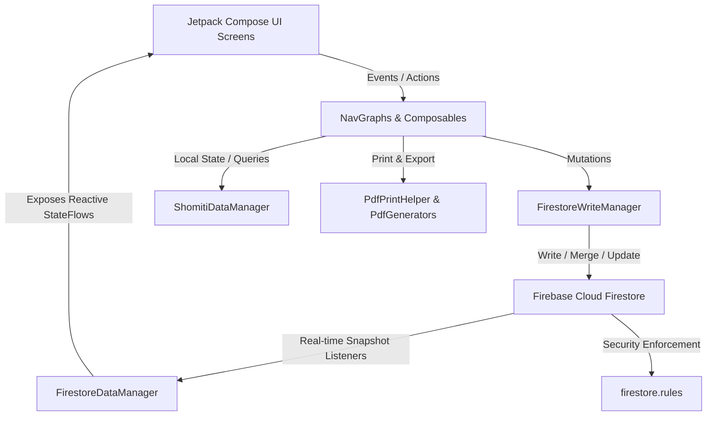

# Ogrogami Fund Somithi ERP — Complete System Handbook & Architecture Guide
### (অগ্রগামী ফান্ড সমিতি ইআরপি — পূর্ণাঙ্গ হ্যান্ডবুক ও সিস্টেম আর্কিটেকচার নির্দেশিকা)

> **Document Purpose**: This document contains the complete background, vision, functional workflows, architectural design, database schema, security model, and feature catalog of the **Ogrogami Fund Somithi ERP** app. Any AI agent, developer, or pair-programmer working on this codebase MUST read and follow this guide to understand how the system works and how each feature is structured.

---

## 1. The Vision & Real-Life Origin (পটভূমি ও মূল লক্ষ্য)

### A. The Story Behind the App
The app was created by the alumni of **"অগ্রগামী ফান্ড (দাখিল ব্যাচ ২০১৫)"** (Ogrogami Fund - Dakhil Batch 2015).
- **Core Purpose**:
  - Welfare and sustainable infrastructure development for their madrasa.
  - Providing mutual financial aid, emergency assistance, and interest-free loans (Qard Hasan - কর্জে হাসানা) to batchmates and community members.
  - Running a 100% transparent, automated, and digital cooperative fund (সমিতি তহবিল) that replaces vulnerable paper registers.

### B. Multi-Somithi & Multi-Branch Architecture
- The system supports **multiple Somithi funds / branches** inside a single unified platform (e.g. *অগ্রগামী ফান্ড - দাখিল ব্যাচ ২০১৫*, *অগ্রগামী ক্ষুদ্র ব্যবসায়ী সমবায় সমিতি*, etc.).
- **Privacy & Isolation Rule**:
  - A user does NOT automatically belong to all Somithis.
  - A member can only view the detailed internal records (who paid, who is in default, itemized expense vouchers, full member list) of the specific Somithi/branch they are approved in.
  - Non-members or prospective members can only view public information (Somithi name, monthly deposit amount, established year, terms and conditions) to submit an application.
- **Fund Creation**:
  - Only the **Root Super Admin** can create and configure new Somithi funds, set their banking/mobile accounts (bKash/Nagad), and define member view permissions.

---

## 2. User Roles & Permission Hierarchy (ব্যবহারকারী রোল ও পারমিশন)

| Role | Target Identifiers | Scope & Permissions |
|---|---|---|
| **Root Super Admin** | `omarfaruktitbd@gmail.com`, `omarfarukitbd@gmail.com` | **Full cross-branch authority**: Automatic `APPROVED` status. Can create/manage all branches, approve/reject member signups, verify member bKash/Nagad/Bank deposits, collect cash, disburse loans, record expenses, print reports, run dividend distribution, and is the **only role authorized to execute deletions** in Firestore. |
| **Branch Admin / Treasurer** | Designated branch treasurer user ID | **Branch-level administrative control**: Manage members within their assigned branch, record payments/expenses, review loan installments, publish branch notices, and review branch reports. |
| **Approved Member** | Linked to active Member profile | **Self & Branch View Access**: View own profile, access **Digital Passbook (পাসবই)**, submit deposits with TrxID, download payment receipts & Member ID card, view committee directory, public notices, and view branch defaulter list. |
| **Pending User** | Any newly signed-in Google/Email account | **Gated Access**: Held at `PendingApprovalScreen`. Can view branch terms to apply for membership, but cannot view internal member records until approved by Super Admin. |

---

## 3. Complete Feature Catalog (অ্যাপের সকল ফিচার তালিকা)

### 1. Authentication & Approval Gateway
- **Google Sign-In & Email/Password**: Secure authentication via Firebase Auth (`AuthRepositoryImpl.kt`).
- **Super Admin Auto-Approval**: Super Admin emails are automatically detected and granted instant access without manual review (`AuthNavGraph.kt`).
- **Pending Approval Screen** (`PendingApprovalScreen.kt`):
  - Gating screen for newly registered users with real-time status check.
  - Allows prospective members to submit membership applications directly.

### 2. Multi-Somithi Fund Management
- **Fund Creation & Customization** (`CreateSomithiFundScreen.kt`):
  - Fund name, description, and mandatory monthly contribution amount.
  - bKash merchant/personal number, Nagad number, and Bank account details (Account Name, Account No, Branch, Routing No).
  - Member View Permissions toggles:
    - Total fund balance visibility (`canMembersViewTotalFund`).
    - Expense vouchers visibility (`canMembersViewExpenses`).
    - Full member list visibility (`canMembersViewMemberList`).
- **Branch Directory** (`BranchManagementScreen.kt`): Real-time overview of all funds, member counts, and balances.

### 3. Member Digital Passbook (সদস্য ডিজিটাল পাসবই)
- **Files**: [`MemberPassbookScreen.kt`](file:///d:/android/Project/MyApplicationSomithiERP/app/src/main/java/com/helptrickbd/myapplicationsomithierp/presentation/screens/members/MemberPassbookScreen.kt), [`PassbookComponents.kt`](file:///d:/android/Project/MyApplicationSomithiERP/app/src/main/java/com/helptrickbd/myapplicationsomithierp/presentation/screens/members/components/PassbookComponents.kt), [`PassbookLedgerComponents.kt`](file:///d:/android/Project/MyApplicationSomithiERP/app/src/main/java/com/helptrickbd/myapplicationsomithierp/presentation/screens/members/components/PassbookLedgerComponents.kt).
- **Features**:
  - **Passbook Profile Header**: Member Photo, Name, Somithi Name, Member ID, Mobile No.
  - **Financial Summary Cards**: মোট সঞ্চয় জমা (Total Savings), বর্তমান বকেয়া (Dues), চলতি ঋণ (Active Loans), অপেক্ষমাণ জমা (Pending).
  - **Visual 12-Month Contribution Tracker (১২ মাসের জমার অবস্থা)**:
    - Interactive 12-month grid (January - December) for years 2025 and 2026.
    - Status indicators: Paid (পরিশোধিত - Green), Pending Verification (যাচাইাধীন - Amber), Unpaid (বাকি/আসন্ন - Outline).
    - Tapping any paid month opens the official Money Receipt PDF.
  - **Chronological Transaction Ledger (লেনদেনের খাতা)**:
    - Filter chips: `সকল (All)`, `অনুমোদিত (Approved)`, `অপেক্ষমাণ (Pending)`.
    - Shows Date, Month, Method, TrxID, Amount, and status badge.
    - 1-Tap **"রসিদ (Receipt)"** button to view and print individual receipt.
  - **A4 Statement PDF Print** (`PassbookPdfGenerator.kt`): Generates an official Somithi Passbook Statement with letterhead, financial highlights, complete ledger table, and member/secretary signatures.

### 4. Member Deposit Gateway (bKash, Nagad & Bank)
- **Files**: [`MemberDepositScreen.kt`](file:///d:/android/Project/MyApplicationSomithiERP/app/src/main/java/com/helptrickbd/myapplicationsomithierp/presentation/screens/payments/MemberDepositScreen.kt), [`DepositComponents.kt`](file:///d:/android/Project/MyApplicationSomithiERP/app/src/main/java/com/helptrickbd/myapplicationsomithierp/presentation/screens/payments/components/DepositComponents.kt).
- **Features**:
  - 3 tabs: **বিকাশ (bKash)**, **নগদ (Nagad)**, **ব্যাংক (Bank)**.
  - 1-Tap copy button for Somithi account/merchant numbers and bank routing info.
  - Input fields for Amount, Contribution Month (dropdown), and Transaction ID (TrxID) with 1-tap clipboard paste.
  - Submits payment to Firestore with `ApprovalStatus.PENDING`.

### 5. Admin Verification & Approval Queue (জমা যাচাই ও অনুমোদন)
- **File**: [`AdminPendingDepositsScreen.kt`](file:///d:/android/Project/MyApplicationSomithiERP/app/src/main/java/com/helptrickbd/myapplicationsomithierp/presentation/screens/admin/AdminPendingDepositsScreen.kt).
- **Features**:
  - Lists all member deposits awaiting verification in real time.
  - 1-Tap TrxID copy button for admins to quickly cross-check with SMS / merchant statement.
  - **Approve Button**: Instantly marks payment as `APPROVED`, assigns an official receipt number (`REC-yyyyMM-XXXX`), and updates the Somithi fund balance.
  - **Reject Button**: Opens dialog to enter rejection reason (e.g., "Invalid TrxID", "Amount mismatch").

### 6. Cash Collection & Official Money Receipts
- **Files**: [`RecordPaymentScreen.kt`](file:///d:/android/Project/MyApplicationSomithiERP/app/src/main/java/com/helptrickbd/myapplicationsomithierp/presentation/screens/payments/RecordPaymentScreen.kt), [`PaymentReceiptPdfGenerator.kt`](file:///d:/android/Project/MyApplicationSomithiERP/app/src/main/java/com/helptrickbd/myapplicationsomithierp/core/pdf/PaymentReceiptPdfGenerator.kt).
- **Features**:
  - Direct cash contribution collection by Admin/Treasurer.
  - Duplicate payment prevention alert if contribution was already paid for that month.
  - Automatically converts amounts into Bangla words and English words (e.g. *এক হাজার টাকা মাত্র*).
  - Official A5 printable PDF receipt with security watermark and dual signatures.

### 7. Expense Register & Development Vouchers
- **Files**: [`ExpenseListScreen.kt`](file:///d:/android/Project/MyApplicationSomithiERP/app/src/main/java/com/helptrickbd/myapplicationsomithierp/presentation/screens/expenses/ExpenseListScreen.kt), [`AddExpenseScreen.kt`](file:///d:/android/Project/MyApplicationSomithiERP/app/src/main/java/com/helptrickbd/myapplicationsomithierp/presentation/screens/expenses/AddExpenseScreen.kt).
- **Features**:
  - Categorized expenses: Madrasa Development (মাদরাসা উন্নয়ন), Social Welfare, Stationery, Admin, Emergency.
  - Tracks payee, purpose note, voucher date, and category. Deducts from Somithi balance in real time.

### 8. Interest-Free Welfare Loans (কর্জে হাসানা)
- **Files**: [`LoanListScreen.kt`](file:///d:/android/Project/MyApplicationSomithiERP/app/src/main/java/com/helptrickbd/myapplicationsomithierp/presentation/screens/loans/LoanListScreen.kt), [`IssueLoanScreen.kt`](file:///d:/android/Project/MyApplicationSomithiERP/app/src/main/java/com/helptrickbd/myapplicationsomithierp/presentation/screens/loans/IssueLoanScreen.kt).
- **Features**:
  - 100% Shariah-compliant, interest-free welfare loans (Qard Hasan).
  - Configurable loan amount, reason, and monthly installment schedule.
  - Real-time installment repayment logging with updated outstanding balance.

### 9. Defaulters List & Direct Calling/WhatsApp
- **File**: [`DefaulterListScreen.kt`](file:///d:/android/Project/MyApplicationSomithiERP/app/src/main/java/com/helptrickbd/myapplicationsomithierp/presentation/screens/payments/DefaulterListScreen.kt).
- **Features**:
  - Real-time calculation of unpaid dues based on monthly deposit requirements.
  - Ranked defaulter list.
  - 1-Tap direct phone dialer (`tel:`) launch.
  - 1-Tap direct WhatsApp launcher with a polite, pre-filled reminder message in Bengali.

### 10. Printable Member ID Card (PVC Card Generator)
- **Files**: [`MemberIdCardPreviewScreen.kt`](file:///d:/android/Project/MyApplicationSomithiERP/app/src/main/java/com/helptrickbd/myapplicationsomithierp/presentation/screens/members/MemberIdCardPreviewScreen.kt), [`MemberIdCardGenerator.kt`](file:///d:/android/Project/MyApplicationSomithiERP/app/src/main/java/com/helptrickbd/myapplicationsomithierp/core/pdf/MemberIdCardGenerator.kt).
- **Features**:
  - High-resolution standard credit-card sized (CR80) 2-sided PVC printable card.
  - Front: Somithi Logo, Member Photo, Full Name, ID, Designation, Blood Group, Mobile.
  - Back: Emergency contact, Join date, Terms, QR code, and President/Secretary authorized signature.

### 11. Committee Directory & Digital Notice Board
- **Committee** (`CommitteeScreen.kt`): Directory of President, Secretary, Treasurer, and Executive Members with contact options.
- **Notice Board** (`NoticeBoardScreen.kt`): Publish general announcements, AGM meeting resolutions, and emergency notices.

### 12. Financial Reports & Audit Export
- **Files**: [`ReportsScreen.kt`](file:///d:/android/Project/MyApplicationSomithiERP/app/src/main/java/com/helptrickbd/myapplicationsomithierp/presentation/screens/reports/ReportsScreen.kt), [`ReportPdfGenerator.kt`](file:///d:/android/Project/MyApplicationSomithiERP/app/src/main/java/com/helptrickbd/myapplicationsomithierp/core/pdf/ReportPdfGenerator.kt).
- **Features**:
  - Tabular income, expense, and net surplus calculation.
  - Printable A4 summary reports for monthly meetings and annual audits.

### 13. Offline Backup & Data Export
- **File**: [`DataBackupManager.kt`](file:///d:/android/Project/MyApplicationSomithiERP/app/src/main/java/com/helptrickbd/myapplicationsomithierp/core/backup/DataBackupManager.kt).
- **Features**:
  - 1-Tap full JSON export of members, payments, expenses, loans, committee, and notices.
  - Uses Android `FileProvider` to safely share backup files via WhatsApp, Google Drive, or Email.

---

## 4. Technical Architecture & Data Flow (প্রযুক্তি ও ডেটা প্রবাহ)

### Key Architectural Layers:
1. **Presentation (`presentation/`)**:
   - `screens/`: Feature modules (`dashboard`, `members`, `payments`, `admin`, `loans`, `expenses`, `governance`, `reports`, `settings`).
   - `navigation/`: Separated, focused navigation graphs (`AppNavigation.kt`, `MemberNavGraph.kt`, `FinancialNavGraph.kt`, `AdminNavGraph.kt`, `AuthNavGraph.kt`).
2. **Domain (`domain/`)**:
   - Pure Kotlin data models (`Member.kt`, `FinancialModels.kt`, `User.kt`, `NotificationItem.kt`).
   - Repository interfaces (`NotificationRepository.kt`).
3. **Core Data & Cloud Sync (`core/data/`)**:
   - `FirestoreDataManager.kt`: Listens to Firestore collections (`branches`, `members`, `payments`, `expenses`, `loans`, `memberApplications`) and maintains reactive `StateFlow` streams.
   - `FirestoreWriteManager.kt`: Writes mutations directly to Firebase Firestore collections with graceful local caching.
   - `FirestoreDataSeeder.kt`: Automatically seeds initial Bangladeshi Somithi data on first launch if cloud collections are empty.
4. **PDF Framework (`core/pdf/`)**:
   - `PdfPrintHelper.kt`: Custom Activity context resolver to prevent Android PrintManager crashes.
   - `PassbookPdfGenerator.kt`, `PaymentReceiptPdfGenerator.kt`, `MemberIdCardGenerator.kt`, `ReportPdfGenerator.kt`.
5. **UI Theming & Design Tokens (`ui/theme/`)**:
   - `MoneyIncomeGreen` (`#10B981`), `MoneyExpenseRed` (`#EF4444`), `MoneyDueAmber` (`#F59E0B`).
   - `Color.kt`, `Theme.kt`, `Type.kt` using Google Font **Hind Siliguri**.

---

## 5. Security Model (`firestore.rules`)

- **Root Super Admin Rule**:
  - Emails `omarfaruktitbd@gmail.com` and `omarfarukitbd@gmail.com` have unrestricted access across all collections.
- **Strict Deletion Lock**:
  - `allow delete: if isSuperAdmin();`
  - No member, treasurer, or client can delete financial records or member profiles.
- **Member Application & Deposit Submission**:
  - Authenticated users can create member applications and submit deposit records.
  - Only Admins and Super Admins can update payment approval statuses (`APPROVED` / `REJECTED`).

---

## 6. Permanent Coding Guidelines for Future Agents

1. **NO TERMINAL BUILD COMMANDS**:
   - Never execute `./gradlew`, `./gradlew.bat`, or build tasks in the agent terminal without user instruction. The user builds in Android Studio.
2. **LINE LIMIT (< 300 Lines per file)**:
   - Every Kotlin file must remain strictly under 300 lines. Decompose complex screens into single-responsibility composables in a `components/` sub-package.
3. **ZERO EMOJIS**:
   - Never use emojis anywhere in the UI or codebase. Exclusively use official Material 3 vector icons (`androidx.compose.material.icons.Icons`).
4. **PURE BILINGUAL SUPPORT**:
   - Every UI string, button, badge, and dialog must support both Bengali (`bn`) and English (`en`).
5. **MATERIAL 3 DYNAMIC THEMING**:
   - Zero hardcoded colors (`Color.White`, `Color.Black`). Always use `MaterialTheme.colorScheme` tokens.
